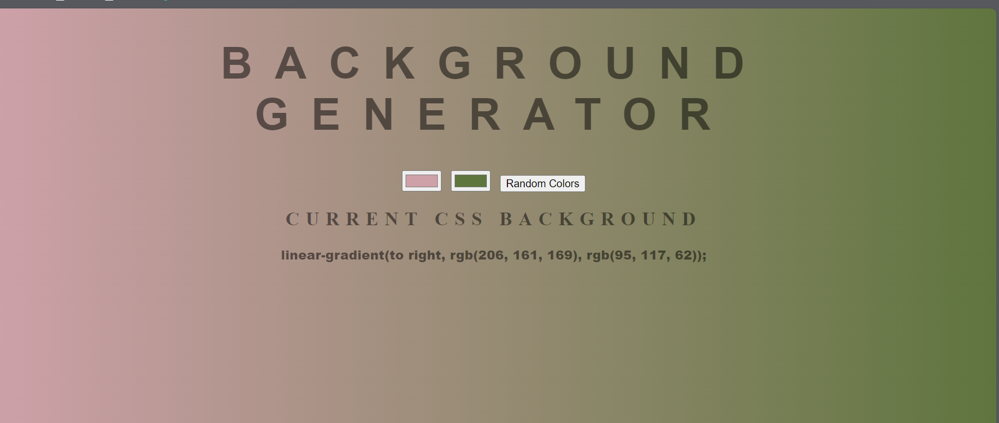

# Gradient Background Generator

This project is a simple web application that allows users to generate a linear gradient background by selecting colors or generating random colors. The selected gradient is displayed as the background of the page, and the corresponding CSS code is shown.

## Features

- Select two colors to create a linear gradient background.
- Generate random colors for the gradient background.
- Display the CSS code for the current gradient background.

## Getting Started

### Prerequisites

To run this project, you need a web browser that supports HTML5, CSS3, and JavaScript.

### Installation

1. Clone the repository or download the project files.
2. Open the `index.html` file in your web browser.

### Usage

1. Open the `index.html` file in your web browser.
2. Use the color input fields to select two colors for the gradient background.
3. Click the "Random Colors" button to generate random colors for the gradient background.
4. The CSS code for the current gradient background will be displayed below the color inputs.

## Project Structure

- `index.html`: The main HTML file that contains the structure of the web page.
- `style.css`: The CSS file that contains the styles for the web page.
- `script.js`: The JavaScript file that contains the logic for generating and displaying the gradient background.

## Example

## Acknowledgments

- Created this project as part of learning excersise from https://zerotomastery.io/.
